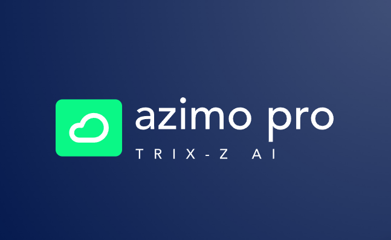

# **Azimo Pro Trix-Z** 🌊💡  
_Launch Date: 26/11/2024_  

---

### 🚀 **Welcome to Azimo Pro Trix-Z**  
Azimo Pro Trix-Z represents the pinnacle of decentralized technology, merging advanced quantum computing with neural networks, **Seal Learning**, and the revolutionary **Trix-Z architecture**. This platform is designed for **HoloFi**, **DeFi**, and next-gen AI-driven dApps, empowering developers with the tools to unlock limitless possibilities in decentralized ecosystems.  

---

## 🧠 **Key Features**  

### 🔗 **Self Sea Neural Links**  
Enable real-time, chain-linked neural networks for seamless data sharing and adaptive decision-making across decentralized platforms.  

### 🔥 **Fire Bunny Pistons**  
High-performance data stream optimization ensures lightning-fast operations with minimal latency.  

### ⚡ **Seal Learning Integration**  
Train AI models with hyper-refined data, optimizing learning cycles for superior precision and adaptability.  

### 🔒 **Trix-Z BJX Protocols**  
Advanced security protocols patented by Bosco Jones, ensuring unparalleled data integrity and ecosystem stability.  

### 🌐 **HoloFi & DeFi Compatibility**  
Built for seamless integration with HoloFi and DeFi platforms, enabling scalable and intelligent dApp development.  

### 🌀 **Quantum-Enhanced Processing**  
Powered by Trix-Z quantum nodes, Azimo Pro achieves breakthrough efficiency and computational speed.  

---

## 🛠️ **Getting Started**  

### 1. **Clone the Repository:**  
```bash  
git clone https://github.com/your-repo/azimo-pro-trix-z.git  
cd azimo-pro-trix-z  
```  

### 2. **Install Dependencies:**  
```bash  
npm install  
```  

### 3. **Run the Engine:**  
```bash  
npm start  
```  

### 4. **Access the Dashboard:**  
Navigate to `http://localhost:3000` in your browser to explore the Azimo Pro Trix-Z dashboard, neural connections, and dApp tools.  

---

## ✨ **Features at a Glance**  

| **Feature**            | **Description**                                | **Status**   |  
|-------------------------|-----------------------------------------------|--------------|  
| Self Sea Neural Links   | Real-time adaptive neural network flows       | ✅ Ready      |  
| Fire Bunny Pistons      | Optimized high-speed data streams             | ✅ Ready      |  
| Trix-Z BJX Protocols    | Quantum-secured, efficient data processes     | ✅ Ready      |  
| HoloFi Compatibility    | Fully integrated with the HoloFi ecosystem    | ✅ Ready      |  
| Seal Learning AI Models | AI-driven adaptive dApp frameworks            | ✅ Ready      |  

---

## 📚 **Documentation**  
Detailed guides and examples can be found in the [Official Documentation](https://docs.azimo-trixz.io).  

---

## 👨‍💻 **Contributing**  

We welcome contributions to improve Azimo Pro Trix-Z!  

1. Fork the repository.  
2. Create a feature branch.  
3. Submit a pull request with detailed changes and justifications.  

---

## 🛡️ **License**  

This project is licensed under the **Apache 2.0 License**. See the `LICENSE` file for full details.  

---

### **Azimo Pro Trix-Z Logo**  
  

Join us on this transformative journey to redefine decentralized ecosystems with **Azimo Pro Trix-Z**! 🌐✨
### **Azimo Logo**  


